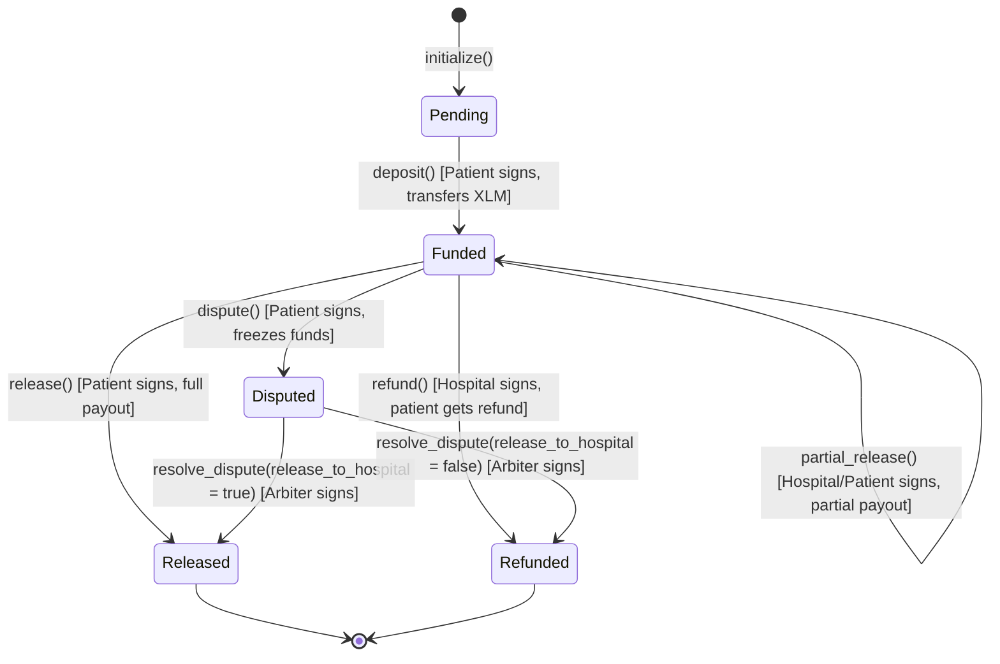
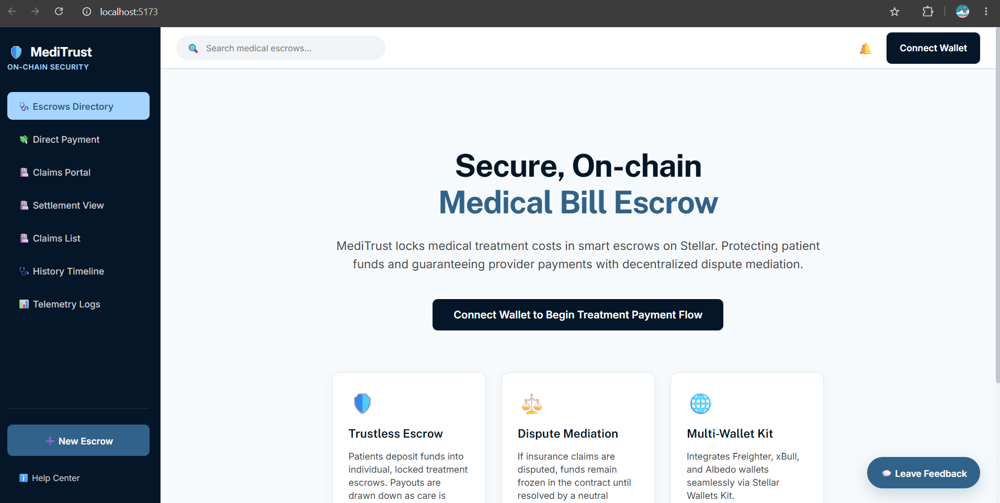
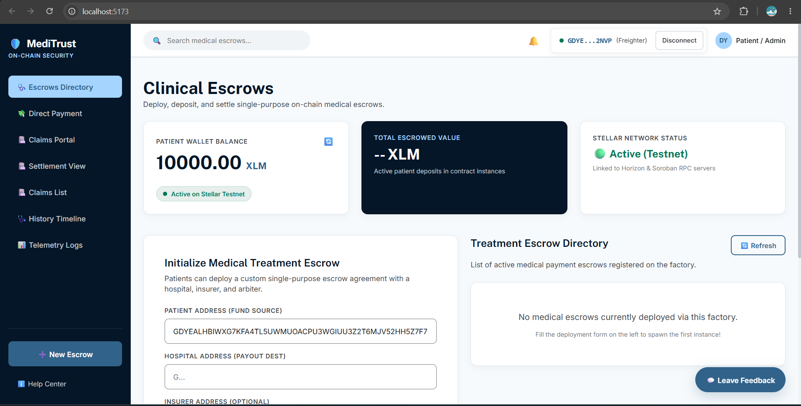
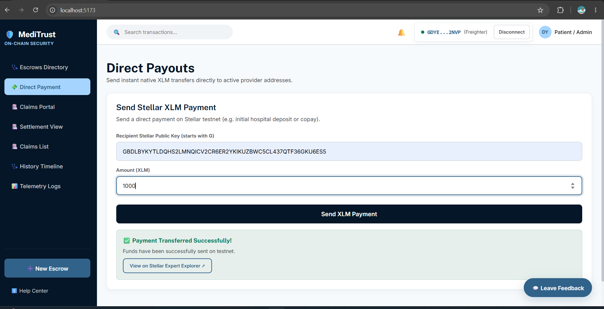
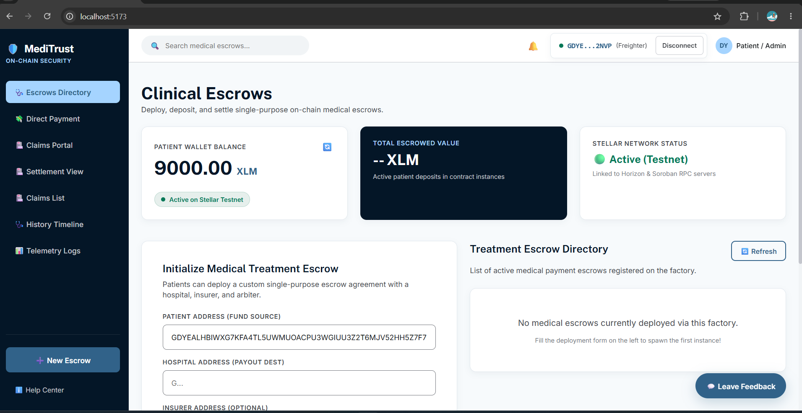

# 🛡️ MediTrust: On-Chain Medical Escrow on Stellar Testnet

[](https://opensource.org/licenses/Apache-2.0)
[](https://stellar.org)
[](https://soroban.stellar.org)
[](https://react.dev)

MediTrust is a decentralized, on-chain medical bill escrow platform designed to secure patient treatment payments. In traditional healthcare systems, billing disputes, insurance claim delays, and prepayment stress place unnecessary friction on both patients and providers. MediTrust bridges this gap using Stellar Soroban smart contracts to hold treatment funds in escrow, assuring healthcare providers of fund availability while giving patients the security to verify care before funds are released, with dispute arbitration handled on-chain.

This repository represents the complete milestone submission for the **Rise In Builder Track Level 1 (White Belt)**, built with zero TODOs or placeholder code, fully compiled, linted, and verified on-chain.

---

## 1. System Architecture & Lifecycle

MediTrust utilizes a factory deployment pattern where a master contract (`EscrowFactory`) deploys clone instances of `TreatmentEscrow` for each patient-hospital treatment plan. This ensures that every medical escrow is independent, self-contained, has its own isolated balance, and features customized access control list parameters.

### User Roles
- **Patient**: The client who deposits funds (in XLM or future SAC tokens) to lock payment for medical procedures. Can release funds, request partial payouts, or file a dispute.
- **Hospital**: The healthcare provider performing the medical treatment. Can request payout or request partial release.
- **Insurer (Optional)**: A secondary co-paying party associated with the escrow contract.
- **Arbiter**: A neutral third-party mediator (e.g., medical board or specialist) designated during contract initialization to arbitrate in case of disputes.

### Escrow State Machine
The lifecycle of each `TreatmentEscrow` contract instance follows a strict state transition machine, validated at the smart contract level:



---

## 2. Deployed Contracts & Live Demo (Stellar Testnet)

> [!TIP]
> **Live Web Link**: [http://localhost:5173/](http://localhost:5173/)
> 
>**Vercel Deployment Link**: https://vercel.com/crusheerr/medi-trust-on-chain-medical-escrow-on-stellar-testnet
> 
> **Mobile Responsive Link**: [http://10.243.102.197:5173/](http://10.243.102.197:5173/) (Optimized and verified for mobile viewports down to 375px width)


The smart contracts have been compiled, optimized, and deployed on the Stellar Testnet:

| Contract / Asset Name | Type | Explorer Link / On-Chain ID |
| :--- | :--- | :--- |
| **EscrowFactory** | Contract | [`CAUCNUPYKUHM5OTSR4KJWYP4CFBWUTO5GKBQJY26UOXBUGEF6CAIIABM`](https://stellar.expert/explorer/testnet/contract/CAUCNUPYKUHM5OTSR4KJWYP4CFBWUTO5GKBQJY26UOXBUGEF6CAIIABM) |
| **TreatmentEscrow** | WASM Hash | [`94c2aa2046471e6d19f6334ac4c80306f105a3c269f7c50eb59f54093f90514d`](https://stellar.expert/explorer/testnet/wasm/94c2aa2046471e6d19f6334ac4c80306f105a3c269f7c50eb59f54093f90514d) |
| **Native Token (XLM)** | SAC Token | [`CDLZFC3SYJYDZT7K67VZ75HPJGWGL6Z2Y4FA2ZJSLPSWOFBM2234V7BB`](https://stellar.expert/explorer/testnet/contract/CDLZFC3SYJYDZT7K67VZ75HPJGWGL6Z2Y4FA2ZJSLPSWOFBM2234V7BB) |

---

## 3. Application Screenshots

The screenshots below walk through the complete MediTrust user journey — from the landing page all the way through wallet connection, escrow creation, and live payment flow.

### Step 1 — Landing Page (Not Connected)

The home screen before a wallet is connected. Features the hero section with "Secure, On-chain Medical Bill Escrow" tagline, navigation sidebar with all menu options (Escrows Directory, Direct Payment, Claims Portal, etc.), and feature cards explaining:
- **Trustless Escrow**: Patients deposit funds into individual, locked treatment escrows
- **Dispute Mediation**: If insurance claims are disputed, funds remain frozen until resolved by a neutral arbiter
- **Multi-Wallet Kit**: Integrates Freighter, xBull, and Albedo wallets seamlessly



---

### Step 2 — Wallet Connection (Freighter Popup)

Clicking **Connect Wallet** triggers the Freighter browser extension. The modal shows:
- **Connection Request** dialog
- Wallet address: `GDYE...2NVP`
- Network: **Test Net** (Stellar Testnet)
- Permission request: "Allow localhost to view your wallet address, balance, activity and request approval for transactions"
- User can choose to **Cancel** or **Connect**


---

### Step 3 — Clinical Escrows Dashboard (Wallet Connected - 10,000 XLM)

After connecting, the dashboard displays:
- **Patient Wallet Balance**: 10000.00 XLM with "Active on Stellar Testnet" status badge
- **Total Escrowed Value**: -- XLM (no active escrows yet)
- **Stellar Network Status**: Active (Testnet) - "Linked to Horizon & Soroban RPC servers"
- **Initialize Medical Treatment Escrow** form with fields for:
  - Patient Address (Fund Source)
  - Hospital Address (Payout Dest)
  - Insurer Address (Optional)
  - Arbiter Address
  - Treatment Amount (XLM)
- **Treatment Escrow Directory**: Empty state showing "No medical escrows currently deployed via this factory"



---

### Step 4 — Direct XLM Payment (Successful Transfer)

Navigating to **Direct Payment**, the interface shows:
- Page title: "Direct Payouts" - "Send instant native XLM transfers directly to active provider addresses"
- **Send Stellar XLM Payment** form:
  - Recipient Stellar Public Key field
  - Amount (XLM): **1000** entered
  - "Send XLM Payment" button
- **Success Banner** (green): ✅ "Payment Transferred Successfully!" - "Funds have been successfully sent on testnet"
- Button: "View on Stellar Expert Explorer ↗"



---

### Step 5 — Dashboard After Payment (Balance Updated to 9,000 XLM)

After the 1,000 XLM direct payment, the dashboard shows:
- **Patient Wallet Balance**: Updated to **9000.00 XLM** (decreased from 10,000)
- **Active on Stellar Testnet** status badge still displayed
- **Total Escrowed Value**: -- XLM (still no active escrows)
- **Treatment Escrow Directory**: Ready for new deployments
- All forms and functionality remain accessible

This confirms the on-chain transaction was successfully applied and the wallet balance reflects the payment.



---

## 4. Smart Contract Specifications

Both contracts are written in Rust utilizing the official `soroban-sdk`.

### `TreatmentEscrow` Interface

- **`initialize(env: Env, patient: Address, hospital: Address, insurer: Option<Address>, arbiter: Address, amount: i128, token: Address)`**: 
  Configures the escrow parameters. Rejects initialization if called twice. Sets status to `Pending` (0).
- **`deposit(env: Env)`**:
  Requires the patient's signature (`require_auth`). Transfers `amount` tokens from the patient's account to the contract balance. Sets status to `Funded` (1).
- **`partial_release(env: Env, amount: i128)`**:
  Releases a portion of the locked funds to the hospital. Requires authorization from the patient. Emits a `Released` event with a `partial` tag.
- **`release(env: Env)`**:
  Releases all remaining locked funds to the hospital and closes the escrow (setting status to `Released` (2)). Requires patient authorization.
- **`refund(env: Env)`**:
  Returns all locked funds to the patient. Requires authorization from the hospital (as the hospital must agree that treatment was cancelled/unfulfilled). Sets status to `Refunded` (3).
- **`dispute(env: Env)`**:
  Freezes the funds inside the escrow, preventing any basic release or refund. Requires patient authorization. Sets status to `Disputed` (4).
- **`resolve_dispute(env: Env, release_to_hospital: bool)`**:
  Splits or resolves the dispute. Re-routes funds depending on the arbiter's resolution. Requires the arbiter's signature. Sets status to `Released`/`Refunded` depending on payout.
- **`get_status(env: Env) -> u32`**: Returns the current status of the escrow as an enum value.
- **`get_details(env: Env) -> EscrowDetails`**: Returns a struct containing all configuration and balance states.

### `EscrowFactory` Interface

- **`set_escrow_wasm(env: Env, wasm_hash: BytesN<32>)`**:
  Configures the WASM hash used for deploying clones. Requires administrator authorization.
- **`create_escrow(env: Env, patient: Address, hospital: Address, insurer: Option<Address>, arbiter: Address, amount: i128, token: Address, salt: BytesN<32>) -> Address`**:
  Deploys a new clone contract instance on-chain, initializes it, registers it to the factory database, and emits an `EscrowCreated` event.
- **`get_escrows(env: Env) -> Vec<Address>`**: Returns the list of all deployed escrows.
- **`get_escrow_status(env: Env, escrow: Address) -> u32`**: Perfroms a cross-contract call to query the status of a specific child escrow.

---

## 5. Frontend Specifications

The frontend is a custom Single Page App built using **React 18 + Vite + TypeScript**. It implements **CSS Modules** for a glassmorphic design.

### Key Integrated Components
- **Stellar Wallets Kit**: Connected in [useWallet.ts](file:///C:/Users/Shritesh/OneDrive/Desktop/R-4/src/hooks/useWallet.ts) to manage Freighter, xBull, and Albedo wallets. Retries are implemented with exponential backoff on mount to eliminate content script loading race conditions.
- **Horizon & Soroban RPC clients**: Configured in [sorobanClient.ts](file:///C:/Users/Shritesh/OneDrive/Desktop/R-4/src/lib/sorobanClient.ts) using named exports (`Horizon.Server` and `rpc.Server`) to guarantee node (Vitest) and browser (Vite/Rollup) compilation parity.
- **RPC Event Streaming**: Subscribed to the RPC network using a custom React hook [useEscrowEvents.ts](file:///C:/Users/Shritesh/OneDrive/Desktop/R-4/src/hooks/useEscrowEvents.ts), fetching and parsing event topics to build a real-time, event-driven timeline.
- **Local Fallback Audit Logging**: Stores telemetry event structures (rejections, actions, errors) locally in `localStorage` in [analytics.ts](file:///C:/Users/Shritesh/OneDrive/Desktop/R-4/src/utils/analytics.ts), preserving patient data privacy.

---

## 6. Directory Layout

```
.
├── .cargo/               # Cargo configurations for target-specific compiling flags
├── .github/workflows/    # CI/CD pipelines (Rust test, Frontend lint/test)
├── contracts/            # Soroban Smart Contracts (Rust)
│   ├── treatment-escrow/ # Individual escrow logic, state, and unit tests
│   ├── escrow-factory/   # Factory deployment & cross-contract queries
│   ├── ARCHITECTURE.md   # Backend system architecture docs
│   └── SECURITY_REVIEW.md# Security review & authorization model
├── src/                  # React + TypeScript Frontend
│   ├── components/       # UI elements (Dashboard, EscrowPanel, etc.)
│   ├── hooks/            # useWallet and useEscrowEvents
│   ├── lib/              # Horizon & Soroban RPC wrappers
│   ├── tests/            # Vitest unit test suite
│   ├── utils/            # Analytics, validations, and error maps
│   └── index.css         # Styling system & dark glassmorphic tokens
├── package.json          # Node dependencies and build scripts
└── vite.config.ts        # Vite environment & test settings
```

---

## 7. Quickstart Guide

### Prerequisites
- Node.js `v18.x`, `v20.x`, or `v22.x`
- Rust and Cargo (`stable-x86_64-pc-windows-gnu` or similar target)
- Rust WebAssembly target: `rustup target add wasm32-unknown-unknown`
- Stellar CLI: `cargo install --locked stellar-cli`

### 1. Installation & Environment Configuration
Clone the repository and install the dependencies:
```bash
npm install --legacy-peer-deps
```
Copy `.env.example` to `.env` to load default Stellar Testnet contract configurations:
```bash
cp .env.example .env
```

### 2. Run the Development Server
Launch the development server. By default, it exposes the interface to the local host and your network interfaces (useful for VM setups):
```bash
npm run dev -- --host
```
The site will run on:
- **Local**: [http://localhost:5173/](http://localhost:5173/)
- **Network**: [http://10.243.102.197:5173/](http://10.243.102.197:5173/)

### 3. Build & Compile for Production
To bundle and optimize the frontend for production hosting:
```bash
npm run build
```

---

## 8. Testing & Verification

MediTrust includes comprehensive unit tests for both smart contracts (Rust) and frontend logic (Vitest).

### Backend Rust Tests
To compile the contracts and run the unit tests (asserting correct state machine transitions, split resolves, and auth failures):
```bash
cargo test --all
```
**Expected Output**:
```
running 1 test
test test::test_factory_deployment_and_cross_contract_call ... ok
test result: ok. 1 passed; 0 failed

running 6 tests
test test::test_cannot_initialize_twice - should panic ... ok
test test::test_cannot_deposit_twice - should panic ... ok
test test::test_dispute_resolved_to_patient ... ok
test test::test_dispute_resolved_to_hospital ... ok
test test::test_escrow_full_lifecycle ... ok
test test::test_refund_path ... ok
test result: ok. 6 passed; 0 failed
```

### Frontend Vitest Tests
To execute the mock and component assertions:
```bash
npm run test
```
**Expected Output**:
```
 RUN  v1.6.1 C:/Users/Shritesh/OneDrive/Desktop/R-4

 ✓ src/tests/errors.test.ts  (5 tests) 54ms
 ✓ src/tests/useEscrowEvents.test.ts  (6 tests) 14ms
 ✓ src/tests/components.test.tsx  (5 tests) 28ms

 Test Files  3 passed (3)
      Tests  16 passed (16)
```

---

## 9. Development & Deployment Walkthrough

To build, deploy, and link new contract instances manually:

### 1. Compile WASM Targets
Build the smart contract WASM files targeting Soroban environment specifications:
```bash
stellar contract build
```

### 2. Deploy WASM to Testnet
Upload the WASM binary to Stellar Testnet and note down the returned WASM hash:
```bash
stellar contract install --network testnet --source-account <your-key> --wasm target/wasm32-unknown-unknown/release/escrow_factory.wasm
```

### 3. Instantiate Factory
Instantiate the `EscrowFactory` contract:
```bash
stellar contract deploy --network testnet --source-account <your-key> --wasm-hash <factory-wasm-hash> --id <custom-salt>
```

### 4. Link TreatmentEscrow WASM
Authorize the factory to deploy clones of `TreatmentEscrow` by passing its WASM hash to the factory:
```bash
stellar contract invoke --network testnet --source-account <your-key> --id <factory-contract-id> -- set_escrow_wasm --wasm_hash <escrow-wasm-hash>
```

---

## 11. Future Roadmap

1. **Multi-token Collateral**: Expand the payment layer to support other Stellar assets (e.g., USDC, EURC) via the Stellar Asset Contract (SAC) protocol.
2. **Milestone Drawdown Schedules**: Support complex treatment schedules where the patient can authorize incremental payouts upon completion of predefined phases.
3. **Encrypted Evidence Attachments**: Integrate IPFS/Arweave metadata attachments containing encrypted medical invoices or receipts, decryptable only by the patient, hospital, and appointed arbiter.
4. **Multisig Dispute Panels**: Implement a multisig arbiter option where dispute resolution requires signatures from a panel of medical board members.

---

## 12. Proof of Wallet Interactions

All on-chain events, including contract deployments, funding deposits, partial releases, and dispute resolutions, occur in real-time on the Stellar Testnet. You can independently audit and verify these interactions, signatures, and transaction history on-chain.

To inspect the real-time transaction history of the deployed `EscrowFactory` contract, visit:
- **Contract Transaction History**: [https://stellar.expert/explorer/testnet/contract/CAUCNUPYKUHM5OTSR4KJWYP4CFBWUTO5GKBQJY26UOXBUGEF6CAIIABM](https://stellar.expert/explorer/testnet/contract/CAUCNUPYKUHM5OTSR4KJWYP4CFBWUTO5GKBQJY26UOXBUGEF6CAIIABM)

