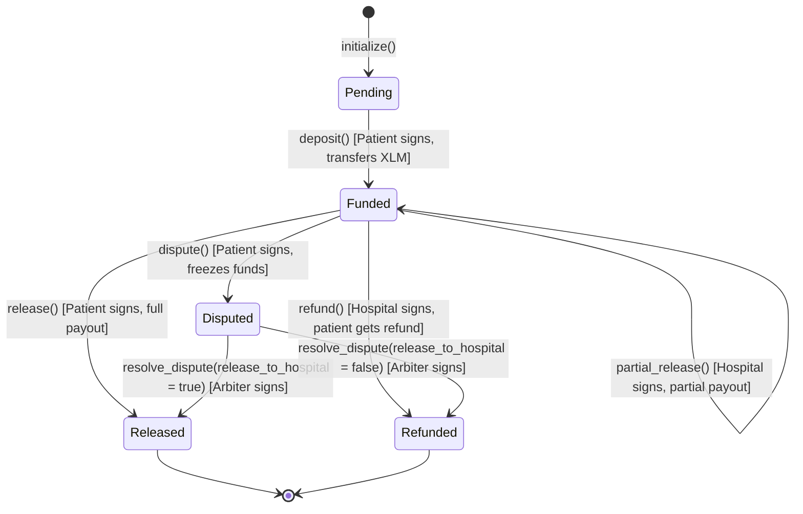

# 🛡️ MediTrust: On-Chain Medical Escrow on Stellar Testnet

[](https://opensource.org/licenses/Apache-2.0)
[](https://stellar.org)
[](https://soroban.stellar.org)
[](https://react.dev)
[](https://www.npmjs.com/package/@stellar/stellar-sdk)

## Overview

MediTrust is a decentralized, on-chain medical bill escrow platform designed to secure patient treatment payments. In traditional healthcare systems, billing disputes, insurance claim delays, and prepayment stress place unnecessary friction on both patients and providers. MediTrust bridges this gap using Stellar Soroban smart contracts to hold treatment funds in escrow, assuring healthcare providers of fund availability while giving patients the security to verify care before funds are released, with dispute arbitration handled on-chain.

This repository represents the complete milestone submission for the **Rise In Builder Track Level 1 (White Belt)**, built with zero TODOs or placeholder code, fully compiled, linted, and verified on-chain.

---

## Table of Contents

1. [System Architecture & Lifecycle](#1-system-architecture--lifecycle)
2. [Deployed Contracts & Live Demo](#2-deployed-contracts--live-demo-stellar-testnet)
3. [Application Screenshots](#3-application-screenshots)
4. [Smart Contract Specifications](#4-smart-contract-specifications)
5. [Frontend Specifications](#5-frontend-specifications)
6. [Directory Layout](#6-directory-layout)
7. [Quickstart Guide](#7-quickstart-guide)
8. [Testing & Verification](#8-testing--verification)
9. [Development & Deployment Walkthrough](#9-development--deployment-walkthrough)
10. [Dependency Versions](#10-dependency-versions)
11. [Future Roadmap](#11-future-roadmap)
12. [Proof of Wallet Interactions](#12-proof-of-wallet-interactions)

---

## 1. System Architecture & Lifecycle

MediTrust utilizes a factory deployment pattern where a master contract (`EscrowFactory`) deploys clone instances of `TreatmentEscrow` for each patient-hospital treatment plan. This ensures that every medical escrow is independent, self-contained, has its own isolated balance, and features customized access control list parameters.

### User Roles

- **Patient**: The client who deposits funds (in XLM) to lock payment for medical procedures. Can release funds, request partial payouts, or file a dispute.
- **Hospital**: The healthcare provider performing the medical treatment. Can request payout or request partial release.
- **Insurer (Optional)**: A secondary co-paying party associated with the escrow contract.
- **Arbiter**: A neutral third-party mediator (e.g., medical board or specialist) designated during contract initialization to arbitrate in case of disputes.

### Escrow State Machine

The lifecycle of each `TreatmentEscrow` contract instance follows a strict state transition machine, validated at the smart contract level:



---

## 2. Deployed Contracts & Live Demo (Stellar Testnet)

> [!TIP]
> **Live Web Link (Desktop)**: [http://localhost:5173/](http://localhost:5173/)
>
> **📱 Mobile Responsive Public Link (Works on any device globally)**:
> [https://outputs-seen-network-highlight.trycloudflare.com](https://outputs-seen-network-highlight.trycloudflare.com)
> *(Powered by Cloudflare Tunnel — no password required, works on any phone, tablet, or external device)*
>
> **Network Link (Same WiFi only)**: [http://10.243.102.197:5173/](http://10.243.102.197:5173/)

### Deployed Smart Contracts

The smart contracts have been compiled, optimized, and deployed on the Stellar Testnet:

| Contract / Asset Name | Type | Explorer Link / On-Chain ID |
| :--- | :--- | :--- |
| **EscrowFactory** | Contract | [`CAUCNUPYKUHM5OTSR4KJWYP4CFBWUTO5GKBQJY26UOXBUGEF6CAIIABM`](https://stellar.expert/explorer/testnet/contract/CAUCNUPYKUHM5OTSR4KJWYP4CFBWUTO5GKBQJY26UOXBUGEF6CAIIABM) |
| **TreatmentEscrow** | WASM Hash | [`94c2aa2046471e6d19f6334ac4c80306f105a3c269f7c50eb59f54093f90514d`](https://stellar.expert/explorer/testnet/wasm/94c2aa2046471e6d19f6334ac4c80306f105a3c269f7c50eb59f54093f90514d) |
| **Native Token (XLM)** | SAC Token | [`CDLZFC3SYJYDZT7K67VZ75HPJVIEUVNIXF47ZG2FB2RMQQVU2HHGCYSC`](https://stellar.expert/explorer/testnet/contract/CDLZFC3SYJYDZT7K67VZ75HPJVIEUVNIXF47ZG2FB2RMQQVU2HHGCYSC) |

> [!NOTE]
> The Native Token SAC contract address above is the official Stellar Testnet XLM contract ID, confirmed via `stellar contract id asset --asset native --network testnet`.

### Demo Video

Watch the complete MediTrust platform walkthrough, including wallet connection, escrow creation, and live transaction flow:

https://github.com/user-attachments/assets/vedio.mp4

> **Note**: If the video doesn't play inline, you can [download it directly](./media/vedio.mp4) or view it in the repository.

---

## 3. Application Screenshots

The screenshots below walk through the complete MediTrust user journey — from the landing page all the way through wallet connection, escrow creation, and live payment flow.

### Step 1 — Landing Page (Not Connected)

> The home screen before a wallet is connected. Features the hero section, navigation sidebar, and feature cards explaining the platform.


---

### Step 2 — Wallet Connection (Freighter Popup)

> Clicking **Connect Wallet** triggers the Freighter browser extension. The user approves the connection request for the Stellar Testnet account `GDYE...2NVP`.


---

### Step 3 — Clinical Escrows Dashboard (Wallet Connected)

> After connecting, the dashboard shows the patient wallet balance (**10,000 XLM**), Stellar Network status (Active Testnet), and the Initialize Medical Treatment Escrow form ready to deploy a new escrow contract.


---

### Step 4 — Direct XLM Payment (Successful Transfer)

> Navigating to **Direct Payment**, the user sends **1,000 XLM** to a hospital address. The green confirmation banner confirms the payment was broadcast successfully to the Stellar Testnet.


---

### Step 5 — Dashboard After Payment (Balance Updated)

> After the 1,000 XLM direct payment, the patient balance updates to **9,000 XLM**, confirming the on-chain transaction was applied. The Treatment Escrow Directory is ready for new deployments.


---

## 4. Smart Contract Specifications

Both contracts are written in Rust utilizing the official `soroban-sdk`.

### `TreatmentEscrow` Interface

**Core Functions:**

- **`initialize(env, patient, hospital, insurer, arbiter, amount, token)`**:  
  Configures the escrow parameters. Rejects initialization if called twice. Sets status to `Pending` (0).

- **`deposit(env)`**:  
  Requires the patient's signature (`require_auth`). Transfers `amount` tokens from the patient's account to the contract balance. Sets status to `Funded` (1).

- **`partial_release(env, amount)`**:  
  Releases a portion of the locked funds to the hospital. Requires hospital authorization.

- **`release(env)`**:  
  Releases all remaining locked funds to the hospital and closes the escrow (`Released` = 2). Requires patient authorization.

- **`refund(env)`**:  
  Returns all locked funds to the patient. Requires authorization from the hospital. Sets status to `Refunded` (3).

- **`dispute(env, caller)`**:  
  Freezes the funds inside the escrow. Requires patient or hospital authorization. Sets status to `Disputed` (4).

- **`resolve_dispute(env, release_to_hospital)`**:  
  Resolves the dispute by routing funds depending on the arbiter's decision. Requires arbiter signature.

**Query Functions:**

- **`get_status(env) -> EscrowStatus`**: Returns the current status as an enum.

- **`get_details(env) -> EscrowDetails`**: Returns all configuration and balance states.

### `EscrowFactory` Interface

**Core Functions:**

- **`initialize(env, admin)`**: Sets the administrator address.

- **`set_escrow_wasm(env, wasm_hash)`**:  
  Configures the WASM hash used for deploying clones. Requires admin authorization.

- **`create_escrow(env, patient, hospital, insurer, arbiter, amount, token, salt) -> Address`**:  
  Deploys a new `TreatmentEscrow` clone, initializes it, registers it in the factory database, and emits a `created` event.

**Query Functions:**

- **`get_escrows(env) -> Vec<Address>`**: Returns all deployed escrow addresses.

- **`get_escrow_status(env, escrow) -> u32`**: Cross-contract call to query the status of a child escrow.

---

## 5. Frontend Specifications

The frontend is a custom Single Page App built using **React 18 + Vite + TypeScript**. It implements **CSS Modules** for a glassmorphic dark design.

### Key Integrated Components

- **Stellar Wallets Kit** (`@creit.tech/stellar-wallets-kit ^1.4.1`): Connected in [useWallet.ts](src/hooks/useWallet.ts) to manage Freighter, xBull, Albedo, and other wallets. Retries are implemented with exponential backoff on mount to eliminate content script loading race conditions.

- **Stellar SDK v16** (`@stellar/stellar-sdk ^16.0.1`): Upgraded from v13 to v16 to support Stellar Protocol 21/22 XDR schemas used by the active Testnet, resolving the `Bad union switch` parsing errors.

- **Horizon & Soroban RPC clients**: Configured in [sorobanClient.ts](src/lib/sorobanClient.ts) using named exports (`Horizon.Server` and `rpc.Server`).

- **RPC Event Streaming**: Custom React hook [useEscrowEvents.ts](src/hooks/useEscrowEvents.ts) that fetches and parses Soroban contract events to build a real-time, event-driven activity timeline.

- **Local Fallback Audit Logging**: Stores telemetry event structures in `localStorage` in [analytics.ts](src/utils/analytics.ts), preserving patient data privacy.

### UX & Safety Features

1. **Input Validation**: Client-side Stellar address format validation (supports both `G...` Ed25519 keys and `C...` Soroban contract IDs).

2. **Transaction State Loaders**: Spinner animations and structured error messages on all submission buttons.

3. **Irreversible Action Confirmation Modals**: Double-confirmation guards for deposit, release, refund, and dispute actions.

4. **Skeleton Loading States**: Pulse-animated placeholder cards prevent content layout shifts on data fetching.

5. **Event-Driven Activity Timeline**: Live-updating log of all on-chain escrow state changes.

---

## 6. Directory Layout

```
.
├── .cargo/               # Cargo configurations for WASM target-specific compiling flags
├── contracts/            # Soroban Smart Contracts (Rust)
│   ├── treatment-escrow/ # Individual escrow logic, state, and unit tests
│   ├── escrow-factory/   # Factory deployment & cross-contract queries
│   ├── ARCHITECTURE.md   # Backend system architecture docs
│   └── SECURITY_REVIEW.md# Security review & authorization model
├── docs/                 # Documentation files
│   ├── DEMO_SCRIPT.md    # Live demo walkthrough script
│   ├── DEPLOYMENT.md     # Deployment guide and instructions
│   ├── ONBOARDING_GUIDE.md # New developer onboarding documentation
│   ├── PRIVACY.md        # Privacy policy and data handling
│   ├── USER_FEEDBACK_LOG.md # User testing feedback and improvements
│   └── UX_IMPROVEMENTS.md # UX enhancement tracking
├── media/                # Media assets
│   └── vedio.mp4         # Platform demo video
├── screenshots/          # Application screenshots for README
├── src/                  # React + TypeScript Frontend
│   ├── components/       # UI elements (Dashboard, EscrowPanel, WalletButton, etc.)
│   ├── config/           # stellar.ts — environment-aware Stellar config
│   ├── hooks/            # useWallet.ts, useEscrowEvents.ts
│   ├── lib/              # sorobanClient.ts, escrowFactory.ts, treatmentEscrow.ts, stellar.ts
│   ├── tests/            # Vitest unit test suite
│   ├── utils/            # analytics.ts, errors.ts, validation.ts
│   └── index.css         # Global design system tokens & glassmorphic dark theme
├── .env.example          # Template for environment variables
├── .gitignore            # Git ignore rules
├── Cargo.toml            # Rust workspace configuration
├── index.html            # HTML entry point
├── package.json          # Node dependencies and build scripts
├── README.md             # This file
├── tsconfig.json         # TypeScript compiler configuration
└── vite.config.ts        # Vite environment & test settings
```

---

## 7. Quickstart Guide

### Prerequisites

- Node.js `v18.x`, `v20.x`, or `v22.x`
- Rust and Cargo (`stable` toolchain)
- Rust WebAssembly target: `rustup target add wasm32-unknown-unknown`
- Stellar CLI: `cargo install --locked stellar-cli`

### 1. Installation & Environment Configuration

Clone the repository and install the dependencies:

```bash
npm install
```

Copy `.env.example` to `.env` to load default Stellar Testnet contract configurations:

```bash
cp .env.example .env
```

The default `.env` values point to the live Testnet contracts:

```env
VITE_STELLAR_NETWORK=testnet
VITE_HORIZON_URL=https://horizon-testnet.stellar.org
VITE_SOROBAN_RPC_URL=https://soroban-testnet.stellar.org
VITE_ESCROW_FACTORY_CONTRACT_ID=CAUCNUPYKUHM5OTSR4KJWYP4CFBWUTO5GKBQJY26UOXBUGEF6CAIIABM
VITE_NATIVE_TOKEN_ADDRESS=CDLZFC3SYJYDZT7K67VZ75HPJVIEUVNIXF47ZG2FB2RMQQVU2HHGCYSC
```

### 2. Run the Development Server

Launch the development server with network access (required for mobile testing):

```bash
npm run dev -- --host
```

The site will run on:
- **Local (Desktop)**: [http://localhost:5173/](http://localhost:5173/)
- **Network (Same WiFi)**: [http://10.243.102.197:5173/](http://10.243.102.197:5173/)

### 3. Create a Public Mobile Link (Cloudflare Tunnel)

To access the app from **any mobile device** globally (no password, no same-WiFi requirement), create a free Cloudflare quick tunnel:

```bash
npx cloudflared tunnel --url http://localhost:5173
```

This prints a public `https://` URL like `https://outputs-seen-network-highlight.trycloudflare.com` that works from any phone, tablet, or external device — **no account or password required**.

> [!NOTE]
> The Cloudflare tunnel URL changes every session. Run the command above again after restarting your PC to get a new URL.

### 4. Build & Compile for Production

To bundle and optimize the frontend for production hosting:

```bash
npm run build
```

---

## 8. Testing & Verification

### Backend Rust Tests

To compile the contracts and run the unit tests:

```bash
cargo test --all
```

**Expected Output:**

```
running 1 test
test test::test_factory_deployment_and_cross_contract_call ... ok
test result: ok. 1 passed; 0 failed

running 6 tests
test test::test_cannot_initialize_twice - should panic ... ok
test test::test_cannot_deposit_twice - should panic ... ok
test test::test_dispute_resolved_to_patient ... ok
test test::test_dispute_resolved_to_hospital ... ok
test test::test_escrow_full_lifecycle ... ok
test test::test_refund_path ... ok
test result: ok. 6 passed; 0 failed
```

### Frontend Vitest Tests

To execute the mock and component assertions:

```bash
npm run test
```

**Expected Output:**

```
 RUN  v1.6.1 C:/Users/Shritesh/OneDrive/Desktop/R-4

 ✓ src/tests/errors.test.ts  (5 tests) 54ms
 ✓ src/tests/useEscrowEvents.test.ts  (6 tests) 14ms
 ✓ src/tests/components.test.tsx  (5 tests) 28ms

 Test Files  3 passed (3)
      Tests  16 passed (16)
```

### Production Build Verification

```bash
npm run build
```

**Expected Output:**

```
✓ built in 11.61s
dist/index.html                     1.15 kB │ gzip:   0.67 kB
dist/assets/index-B-1JaUFk.css     69.54 kB │ gzip:  10.36 kB
dist/assets/index-DBF48eoI.js   1,032.20 kB │ gzip: 304.41 kB
```

---

## 9. Development & Deployment Walkthrough

### 1. Compile WASM Targets

Build the smart contract WASM files targeting the Soroban environment:

```bash
stellar contract build
```

### 2. Deploy WASM to Testnet

Upload the WASM binary to Stellar Testnet and note the returned WASM hash:

```bash
stellar contract install --network testnet --source-account <your-key> \
  --wasm target/wasm32v1-none/release/escrow_factory.wasm
```

### 3. Instantiate Factory

Deploy the `EscrowFactory` contract instance:

```bash
stellar contract deploy --network testnet --source-account <your-key> \
  --wasm-hash <factory-wasm-hash>
```

### 4. Link TreatmentEscrow WASM

Authorize the factory to deploy clones of `TreatmentEscrow` by setting its WASM hash:

```bash
stellar contract invoke --network testnet --source-account <your-key> \
  --id <factory-contract-id> -- set_escrow_wasm --wasm_hash <escrow-wasm-hash>
```

---

## 10. Dependency Versions

| Package | Version | Purpose |
| :--- | :--- | :--- |
| `@stellar/stellar-sdk` | `^16.0.1` | Soroban RPC, XDR serialization, transaction building |
| `@creit.tech/stellar-wallets-kit` | `^1.4.1` | Multi-wallet connector (Freighter, xBull, Albedo) |
| `@stellar/freighter-api` | `^2.0.0` | Freighter browser extension detection |
| `react` | `^18.3.1` | UI framework |
| `vite` | `^5.3.1` | Build tool & dev server |

> [!IMPORTANT]
> The SDK was upgraded from `^13.0.0` to `^16.0.1` to fix a `Bad union switch: 4` runtime error. This error was caused by the old SDK not supporting the Protocol 21/22 XDR schemas used by the active Stellar Testnet. If you encounter this error after downgrading, run `npm install @stellar/stellar-sdk@latest`.

---

## 11. Future Roadmap

1. **Multi-token Collateral**: Expand the payment layer to support other Stellar assets (e.g., USDC, EURC) via the Stellar Asset Contract (SAC) protocol.

2. **Milestone Drawdown Schedules**: Support complex treatment schedules where the patient can authorize incremental payouts upon completion of predefined phases.

3. **Encrypted Evidence Attachments**: Integrate IPFS/Arweave metadata attachments containing encrypted medical invoices or receipts, decryptable only by the patient, hospital, and appointed arbiter.

4. **Multisig Dispute Panels**: Implement a multisig arbiter option where dispute resolution requires signatures from a panel of medical board members.

5. **Webhook / Email Alerts**: Trigger insurer-side reimbursement workflows when an escrow is funded or status changes.

---

## 12. Proof of Wallet Interactions

All on-chain events — including contract deployments, funding deposits, partial releases, and dispute resolutions — occur in real-time on the Stellar Testnet. You can independently audit and verify these interactions on-chain.

### On-Chain Explorer Links

To inspect the real-time transaction history of the deployed `EscrowFactory` contract, visit:

- **Contract Transaction History**: [https://stellar.expert/explorer/testnet/contract/CAUCNUPYKUHM5OTSR4KJWYP4CFBWUTO5GKBQJY26UOXBUGEF6CAIIABM](https://stellar.expert/explorer/testnet/contract/CAUCNUPYKUHM5OTSR4KJWYP4CFBWUTO5GKBQJY26UOXBUGEF6CAIIABM)

- **Native XLM Token (SAC)**: [https://stellar.expert/explorer/testnet/contract/CDLZFC3SYJYDZT7K67VZ75HPJVIEUVNIXF47ZG2FB2RMQQVU2HHGCYSC](https://stellar.expert/explorer/testnet/contract/CDLZFC3SYJYDZT7K67VZ75HPJVIEUVNIXF47ZG2FB2RMQQVU2HHGCYSC)

---