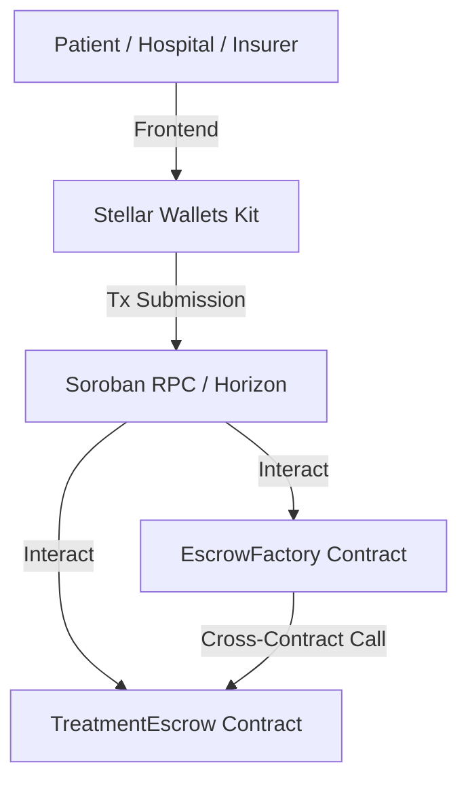

# MediTrust Contract Architecture

This document details the smart contract architecture of the MediTrust on-chain medical bill escrow platform.

## Architecture Diagram

## Contracts Overview

### 1. `TreatmentEscrow`
Models a single, distinct medical payment relationship. 
- **Roles:**
  - `Patient`: The entity funding the escrow.
  - `Hospital`: The healthcare provider receiving releases.
  - `Insurer` (Optional): A third party that can inspect or contribute to the escrow flow (modeled for future claims validation).
  - `Arbiter`: A trusted third party (e.g., medical board or platform administrator) who resolves disputes.
- **States (EscrowStatus):**
  - `Pending` (0): Escrow created, awaiting deposit from the patient.
  - `Funded` (1): Funds locked in contract escrow, ready for release.
  - `Released` (2): Escrow settled fully or partially (released total = amount) to the hospital.
  - `Refunded` (3): Remaining funds returned to the patient.
  - `Disputed` (4): A dispute has been filed by the patient or hospital. Settlement is frozen until the arbiter resolves.

- **Escrow Operations:**
  - `deposit`: Patient transfers the specified amount of XLM into the escrow contract.
  - `partial_release`: Hospital draws down funds progressively.
  - `release`: Hospital settles all remaining funds.
  - `refund`: Patient recovers remaining funds.
  - `dispute`: Initiates dispute status, freezing further releases.
  - `resolve_dispute`: Arbiter decides whether remaining funds go to the hospital or the patient.

### 2. `EscrowFactory`
Acts as a registry and deployer for multiple `TreatmentEscrow` instances.
- **Dynamic Deployment:** Uses Soroban's `deployer()` to deploy a new child instance based on a provided `salt` and the `wasm_hash` of the compiled `TreatmentEscrow` contract.
- **Registry:** Stores a list of all deployed escrow addresses in its contract storage.
- **Cross-Contract Interoperability:** Uses the `get_escrow_status` function to call `get_status` on the child contract directly in Rust, verifying its status cross-contract instead of aggregating client-side.
